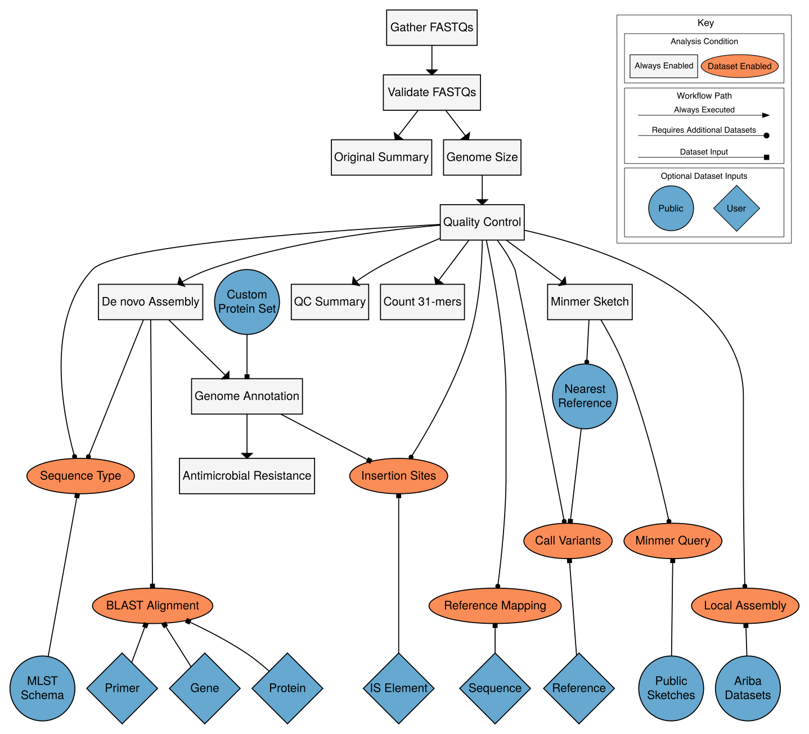

# Overview

Bactopia is a flexible pipeline for complete analysis of bacterial genomes. The goal of Bactopia is process your data with a broad set of tools, so that you can get to the fun part of analyses quicker! 

Bactopia was inspired by [Staphopia](https://staphopia.emory.edu/), a workflow we (Tim Read and myself) released that targets *Staphylococcus aureus* genomes.
Using what we learned from Staphopia and user feedback, Bactopia was developed from scratch with usability, portability, and speed in mind from the start.

Bactopia uses [Nextflow](https://www.nextflow.io/) to manage the workflow, allowing for support of many types of environments (e.g. cluster or cloud). Bactopia allows for the usage of many public datasets as well as your own datasets to further enhance the analysis of your seqeuncing. Bactopia only uses software packages available from
[Bioconda](https://bioconda.github.io/) (or other
[Anaconda channels](https://anaconda.org/)) to make installation
as simple as possible for *all* users.

To highlight the use of [Bactopia Datasets](datasets.md), [Bactopia](workflow-overview.md), and [Bactopia Tools](bactopia-tools/index.md), we performed an analysis of 1,664 public *Lactobacillus* genomes, focusing on *Lactobacillus crispatus*, a species that is a common part of the human vaginal microbiome. The results from this analysis are published in mSystems under the title: *[Bactopia: a flexible pipeline for complete analysis of bacterial genomes](https://doi.org/10.1128/mSystems.00190-20)*

## Bactopia Workflow

## Documentation Overview
[Quick Start](quick-start.md)  
Very concise and to straight the point details (unlike this!) for using Bactopia.  

[Installation](installation.md)  
More detailed information for getting Bactopia set up on your system.

[Basic Usage](usage-basic.md)  
A subset of parameters users may commonly adjust.

[Tutorial](tutorial.md)  
A brief tutorial on how to replicate the [Staphopia Analysis Pipeline](https://staphopia.emory.edu) using Bactopia.

[Build Datasets](datasets.md)  
A description on how to make use of datasets (public or private) with Bactopia.

[Workflow Overview](output-overview.md)  
A description of Bactopia workflow and software used.

[Output Overview](output-overview.md)  
A description of Bactopia output directories and files.

[Complete Usage](usage-complete.md)  
The full set of parameters that users can tweak in Bactopia.

<!--
TODO 
[Examples](examples.md)  
A few examples of things to do with Bactopia.

[FAQ](faq.md)  
A list of common questions we've been asked.
-->

[Acknowledgements](acknowledgements.md)  
A list of datasets and software (and many thanks!) used by Bactopia.
